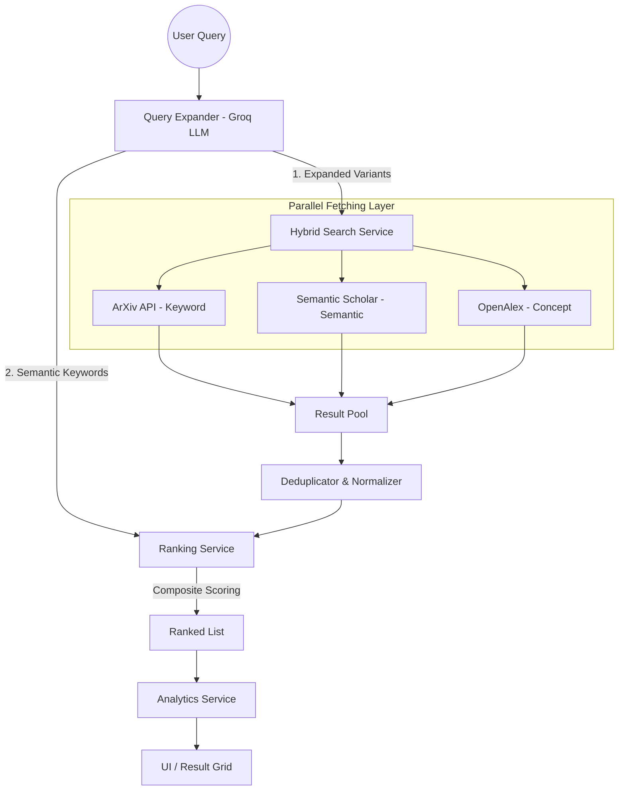

# Approach Document: Enhanced Hybrid Search Agent

This document outlines the full approach and architecture for the **Enhanced Search Agent**, a system designed to bridge the gap between simple keyword-based academic search and context-aware semantic discovery.

## 1. Overview
The primary challenge in academic search is "term mismatch": searching for "transformers" might miss the seminal paper *"Attention Is All You Need"* if the search engine only does literal keyword matching. 

The **Enhanced Search Agent** solves this by using a hybrid pipeline that combines Large Language Models (LLMs) for query expansion and intent understanding with high-performance concurrent fetching from multiple academic sources.

---

## 2. System Architecture

The following diagram illustrates the flow of a single search request:

---

## 3. Detailed Approach

### Phase 1: Query Expansion (The Contextual Layer)
*   **Prompting Strategy:** The system uses Groq (Llama 3 or similar) to transform a short user query into a structured payload.
*   **Expansion Variants:** It generates canonical terms, alternative phrasings, and **landmark paper titles** (e.g., if you search "diffusion models", it adds "Denoising Diffusion Probabilistic Models").
*   **Semantic Keywords:** It extracts a set of core concepts used later for re-ranking, ensuring that even if a paper is found via an expanded variant, it is scored based on its relevance to the core topic.

### Phase 2: Hybrid Search (The Recall Layer)
*   **Fan-out Execution:** The service initiates multiple concurrent threads. Each query variant is sent to:
    *   **ArXiv:** Captures the latest pre-prints via Boolean keyword search.
    *   **Semantic Scholar:** Utilizes their vector-based search to find "semantically related" papers.
    *   **OpenAlex:** Leverages an entity/concept-based graph to find highly cited works.
*   **Concurrency:** A custom multithreaded orchestrator manages the fan-out to minimize latency, with a hard timeout of 25 seconds per source.

### Phase 3: Refinement (The Precision Layer)
*   **Title Normalization:** Papers from different sources are merged using a regex-based title normalization (lowercase + alphanumeric only).
*   **Record Merging:** When duplicates are found, the system keeps the record with the **highest citation count** to ensure data richness.
*   **Composite Ranking:** Every paper is scored using a multi-factor formula:
    $$Score = (S \times w_s) + (R \times w_r) + (C \times w_c)$$
    *   **S (Semantic):** Token overlap between title/abstract and the LLM-generated keywords.
    *   **R (Recency):** Decay function based on publication date.
    *   **C (Citations):** Log-normalized citation count.

### Phase 4: Analytics and Insights
*   **Topic Modeling:** The system aggregates `topic_tags` from all discovered papers to show the "Landscape" of the field.
*   **Trend Analysis:** It calculates the average citation count and publication distribution over time to help users identify if a topic is emerging or established.

---

## 4. Key Components

| Component | Responsibility | Technology |
| :--- | :--- | :--- |
| `SearchAgent` | Orchestration & Pipeline Management | Python |
| `QueryExpander` | LLM-based query transformation | LangChain + Groq |
| `HybridSearchService` | Multithreaded source fetching & dedup | Python Threading |
| `RankingService` | Multi-factor result ordering | NumPy / Math logic |
| `AnalyticsService` | Aggregating trends and metadata | Python |
| `Frontend` | Interactive search & Dashboard | Streamlit / Python |

---

## 5. Current Implementation Status

*   [x] **LLM Integration:** Fully functional with fallback logic if API is down.
*   [x] **Multi-Source Fetching:** ArXiv, Semantic Scholar, and OpenAlex implemented.
*   [x] **Deduplication:** Fuzzy title matching implemented.
*   [x] **Ranking:** Composite scoring active.
*   [x] **Analytics:** Basic topic enrichment and citation stats active.
*   [ ] **Optimization:** Further caching for expensive OpenAlex queries (Planned).
